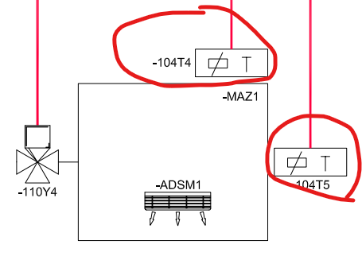
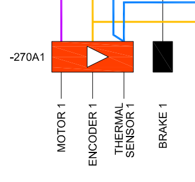
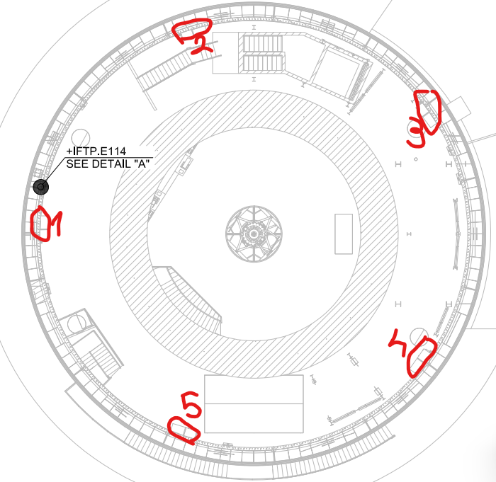
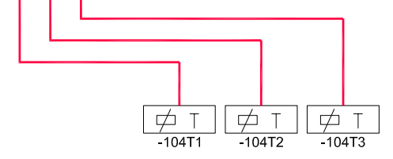

.. py:currentmodule:: lsst.ts.mtdomecom

.. _lsst.ts.mtdomecom-amcs_and_thcs_telemetry_details:

#####################################################
The Order Of The Items In The AMCS And ThCS Telemetry
#####################################################

Drive Temperatures
==================

Every motor of the azimuth rotation system will have two sensors inside the insulation box where the motors will be enclosed.
Two sensors for every motor correspond to 10 sensors.
As of October 2025 it is unclear when the sensors will be installed.

For the driveTemperature telemetry, the order is as follows:

    * Sensor 1 motor 1 (-104T4)
    * Sensor 2 motor 1 (-104T5)
    * Sensor 1 motor 2 (-104T6)
    * Sensor 2 motor 2 (-104T7)
    * Sensor 1 motor 3 (-106T1)
    * Sensor 2 motor 3 (-106T2)
    * Sensor 1 motor 4 (-106T3)
    * Sensor 2 motor 4 (-106T4)
    * Sensor 1 motor 5 (-106T5)
    * Sensor 2 motor 5 (-106T6)

Motor Coil Temperatures
=======================

Every motor has a temperature sensor that measures the temperature of the coils, for a total of 5 sensors.

The 5 sensors are organized in the following order.

    * Motor 1
    * Motor 2
    * Motor 3
    * Motor 4
    * Motor 5

This is a map of the motor positions.
The same rule (first element motor 1, second element motor 2..) applies to all other telemetry elements like current, motor position and so on.

Rotation Cabinet Temperatures
=============================

The other three sensors are temperature sensors for the rotation cabinet placed at 6th floor.
As of October 2025 it is unclear when the sensors will be installed.

The 3 sensors for the cabinet will be organized in the following order:

    * Sensor -104T1
    * Sensor -104T2
    * Sensor -104T3
