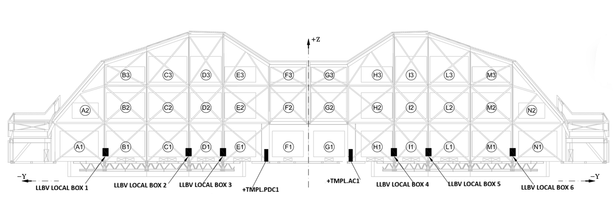

.. py:currentmodule:: lsst.ts.mtdomecom

.. _lsst.ts.mtdomecom-cabinet_and_local_box_locations:

#############################################
The Locations Of The Cabinets And Local Boxes
#############################################

This is a schematic overview of the locations of the cabinets (+TMPL.PDC1 and +TMPLAC1) as well as the local boxes on the MTDome as seen from the inside of the MTDome.

