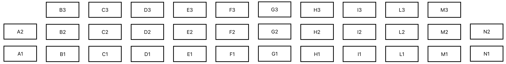

.. py:currentmodule:: lsst.ts.mtdomecom

.. _lsst.ts.mtdomecom-louver_locations:

#############################################
The Order Of The Louvers In The LCS Telemetry
#############################################

The order of the louvers in the LCS telemetry can be seen in the ts_xml MTDome Louvers enum.
The order is as follows.
Note that ts_xml enums are 1-based.
In order to get the position in a Python array, 1 needs to be subtracted from the index since Python enums are 0-based.

    * A1 = 1
    * A2 = 2
    * B1 = 3
    * B2 = 4
    * B3 = 5
    * C1 = 6
    * C2 = 7
    * C3 = 8
    * D1 = 9
    * D2 = 10
    * D3 = 11
    * E1 = 12
    * E2 = 13
    * E3 = 14
    * F1 = 15
    * F2 = 16
    * F3 = 17
    * G1 = 18
    * G2 = 19
    * G3 = 20
    * H1 = 21
    * H2 = 22
    * H3 = 23
    * I1 = 24
    * I2 = 25
    * I3 = 26
    * L1 = 27
    * L2 = 28
    * L3 = 29
    * M1 = 30
    * M2 = 31
    * M3 = 32
    * N1 = 33
    * N2 = 34

This is a schematic overview of the locations of the louvers on the MTDome as seen from the inside of the MTDome.

